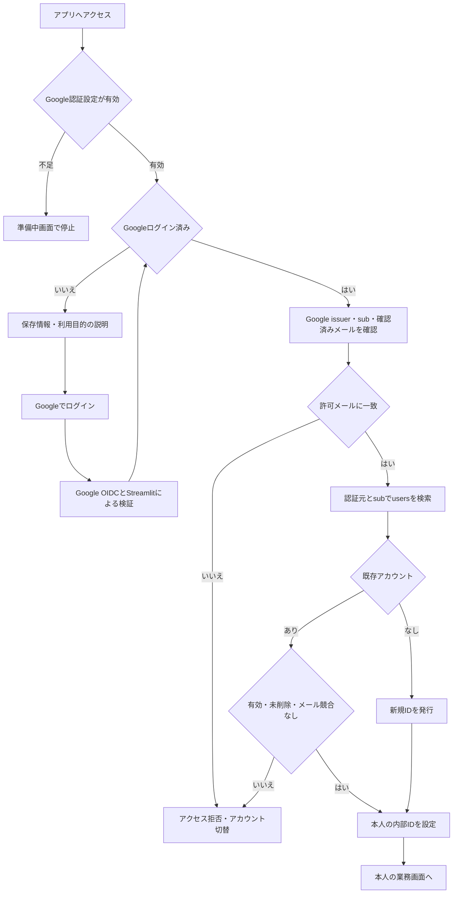
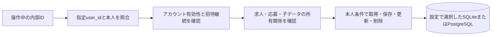
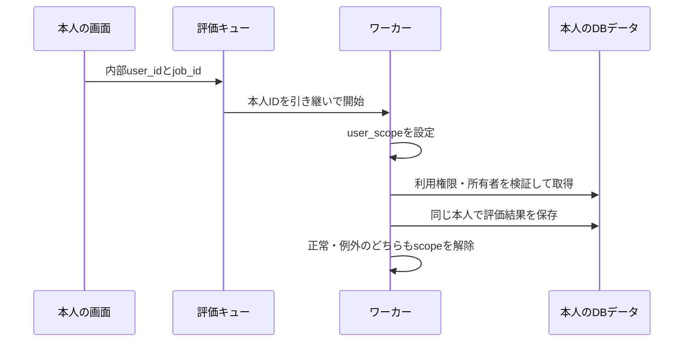
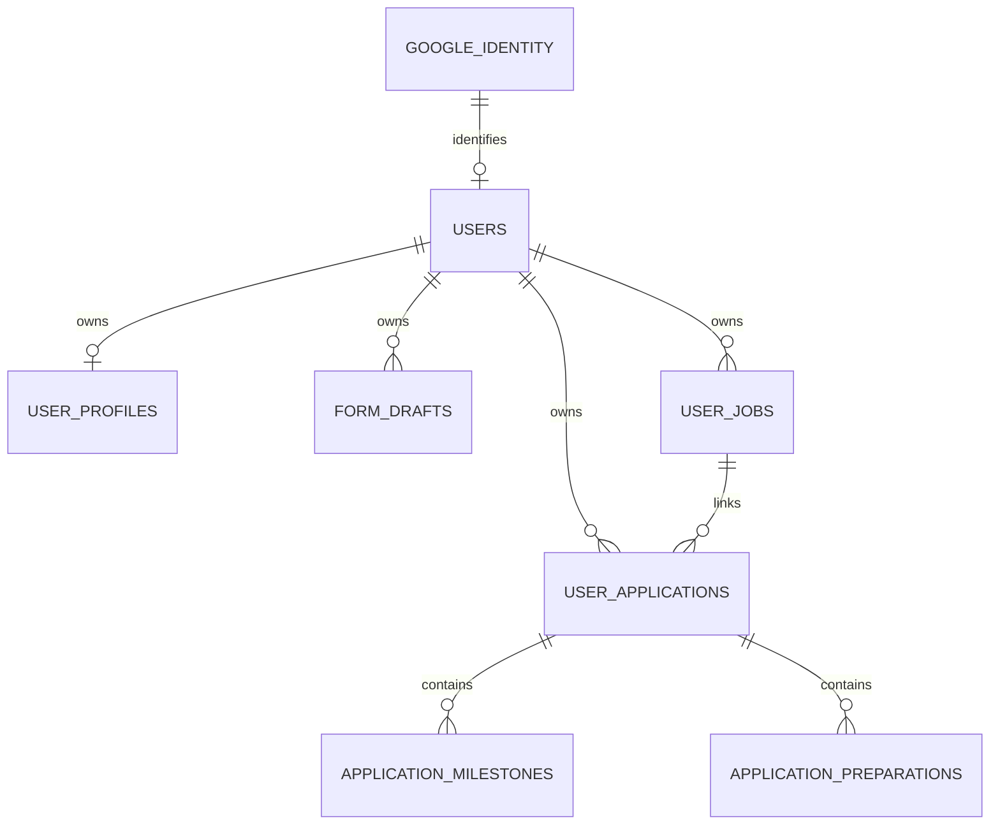

# 利用者アカウント・アクセス制御仕様

> 最新状況（2026-09-10）：Google認証・Neon保存・運営者機能を公開環境へ反映済み。本人ログイン、保存、公開サーバー再起動後の復元を確認。2人目の実アカウント検証は未実施。以下の過去の「公開未反映」記録から進捗があるため、[公開反映・受入確認](public_release_status.md)を現在の確認状況の正とする。

最終更新日：2026年9月10日

## 1. 目的と実装状態

卒業制作発表は完了済み。招待した複数のテストユーザーが、本人の情報を継続して保存・利用できる状態を目指す。
Google個別ログイン、許可メールの判定、内部利用者IDとの紐付け、Repositoryのデータ分離はローカルコードへ実装済み。
Google Cloudの認証アプリ初期設定、外部テストモード、本人1名のテストユーザー登録、ウェブ用OAuthクライアント作成は完了。発行情報のローカル設定への反映・設定形式チェックは完了。実Googleアカウントでの往復ログインとホーム画面表示に成功し、内部ID 2の登録・既存ID 1の保持を確認。画面再読み込み、ログアウト後の再ログインでホームへ復帰し、同一の内部ID 2を維持することを確認。複数の実Googleアカウントでの分離確認と保存内容の再ログイン復元は未完了。詳細は[設定手順](google_login_setup.md)を参照。運営者の閲覧・CSV/JSON出力とデータ利用説明はローカル実装済み。公開環境での受入テストは未完了であり、提供開始済みとはしない。

## 2. 利用者情報

| 列 | 用途 |
|---|---|
| id | 業務データを関連付ける内部の不変ID |
| email | Googleで確認されたメール。招待許可の照合に使用 |
| auth_provider / auth_subject | 認証元googleとGoogleのsub。同一人物の恒久的な識別 |
| display_name / avatar_url | Googleから取得する表示名・画像URL。画像ファイルは取得しない |
| email_verified | 確認済みメールかどうか |
| is_active / deleted_at | 利用停止・論理削除の判定。停止しても業務データは消さない |
| last_login_at | 最後にログイン状態を確認した日時。画面の再実行でも更新する |
| created_at / updated_at | 作成・更新日時 |

メールは大文字・小文字を区別しない一意制約を持つ。認証元とsubの組も一意とする。DBの列追加は再実行可能で、既存のID・業務データを保持する。

## 3. 個別ログインの流れ

- Streamlitの`st.login("google")`・`st.user`・`st.logout()`を利用し、アプリ独自のパスワードは保存しない。
- `resolve_google_user`へ渡すのはStreamlitが検証した`st.user`のみ。URL、フォーム、未検証JWTの情報を入力にしない。
- `iss`はGoogle、`sub`は非空文字列、`email_verified`は真であること。許可メールはSecretsの`access.allowed_emails`で完全一致させる。ワイルドカードやドメイン単位の許可は実装しない。
- 初回は新規利用者を作り、再ログイン時は同じsubから同じ内部IDを復元する。同時初回ログインはSQLiteの書込トランザクション、またはPostgreSQLのトランザクションロックと一意制約で1アカウントにまとめる。
- 同じメールで異なるsubが来た場合は拒否する。メール変更は同じsubであり、新メールが許可済みかつ競合しない場合のみ同じ内部IDで反映する。
- 設定不足、空の許可リスト、未知の認証モードでは停止する。共通パスワードへ自動的に切り替えない。

## 4. 既存の利用者ID 1

既存利用者ID 1とその業務データは保持する。Google初回ログインへ自動的に割り当てず、メールだけで既存データを引き継がせない。
既存データと本人のGoogleアカウントの紐付けは、所有者を確認したうえで行う別の移行作業とする。今回は実施していない。

## 5. データ分離と失効

- 業務データを扱う13 Repositoryで本人と指定user_idを照合する。
- 求人の評価・応募判断・通勤・確認項目は、親求人も本人所有であることを検証する。
- 応募予定・準備・活動・フェーズ履歴は、親の応募と求人を通して本人を確認する。子ID、親ID、延期元の差替えを拒否する。
- GoogleモードではRepositoryでも`is_active`、`deleted_at`、認証情報、許可メールを再確認する。開いたままの画面やバックグラウンドでも、失効を確認した後の読み書きを拒否する。既に開始済みの外部APIリクエストは取り消さない。
- 招待解除はSecretsの許可リストから削除し、アプリを再起動して設定を読み直す。無効化はusers.is_active=0で行う。管理画面は後続で実装する。
- ユーザー切替時は前の人のフォームと選択IDを消し、ログアウト時はセッションとStreamlitの認証Cookieを消す。他タブも次のアプリ再実行でGoogle状態・利用権限を確認するが、Google本体からログアウトする操作ではない。

## 6. AIの非同期処理

`user_scope`は信頼されたサーバー内部専用。ブラウザから渡されたIDをそのまま設定してはならない。
削除済み求人は評価一覧・自動再評価対象から除外する。

## 7. 保存構造

この図は主要な所有関係の抜粋で、全25テーブルの列定義はdatabase/schema.sqlを正とする。希望条件、価値観、経歴、評価、活動履歴も本人に分離する。
SQLiteファイルの再接続テストとCloud上の永続性は別である。ローカルアプリ用のPostgreSQL移行・全件照合は完了。公開環境の再起動・再デプロイ後の保持確認は未実施。

## 8. 設定・テスト・未完了事項

- `METEA_AUTH_MODE="google"`で個別認証、`legacy`は既存ローカル・共通パスワードのデモ互換。Googleモードは本人未設定でID 1に戻らない。
- Googleモードでは`APP_ENV`がdemoでも架空データを自動投入しない。
- 詳しい設定と操作手順は[google_login_setup.md](google_login_setup.md)を参照する。
- 自動テストは`tests/test_google_auth.py`、`tests/test_user_data_isolation.py`、`tests/test_user_account_schema.py`を使用する。実際のGoogle認証をモックするテストは、OAuth往復の検証とは区別する。
- 未完了：公開環境の認証・永続保存・運営者限定閲覧と出力の受入テスト。説明文面と連絡方法の運営者確認。
- 応募管理の「内定は継続中、内定承諾で終了済み」の変更は別の未完了項目。

参考：[Streamlit認証](https://docs.streamlit.io/develop/concepts/connections/authentication)、[Google OIDC](https://developers.google.com/identity/openid-connect/openid-connect)

## 2026年9月10日：保存・復元の確認

実Google利用者ID 2で基本情報の下書きを画面から保存し、画面再読み込みとアプリプロセス再起動後の復元を確認した。別プロセスによる2利用者の永続保存・分離・未コミット変更の破棄も自動テストで確認済み。この時点の検証対象はローカルSQLite。以降のPostgreSQL対応・検証結果は保存設計を参照。公開環境の検証は別途必要。
基本情報の下書きは「次へ」の送信で保存される。送信前のキー入力のみの内容は保存保証の対象ではない。詳細とAs-Is／To-Beは[保存・外部DB移行設計](storage_persistence_spec.md)を参照する。

実ブラウザのタブを閉じ、新しいタブで再アクセスした後も下書きを復元できた。ブラウザアプリ全体の終了は未確認。確認用の下書きのみ削除し、確認前の未入力状態に戻した。

NeonのMeTeA用PostgreSQLをFreeプランで作成済み（Singapore、PostgreSQL 18）。接続情報のローカル設定とTOML形式確認は完了。PostgreSQL対応コードと実接続確認は完了。25テーブル1,276件の移行・全件照合とローカルアプリの切替を実施。詳細は保存設計を参照。公開切替は未実施。詳細は[外部DB移行設計](storage_persistence_spec.md)を参照。

## 2026年9月10日：運営者確認・出力とデータ説明

As-Is：本人用画面とバックアップCLI。今回：通常利用者の分離を維持したまま、運営者に限り利用者別の保存データ確認・CSV/JSON出力を追加した。この機能の保存内容も対象となる。ログイン前・設定画面に保存情報と利用目的、外部送信の説明を追加した。To-Be：公開設定の反映と、別の実Googleアカウントを含む受入確認。詳細は[運営者データ設計](operator_data_spec.md)を参照。
