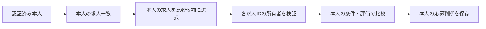

# MeTeA 求人一覧・求人確認・求人比較仕様

> 最新状況（2026-09-10）：Google認証・Neon保存・運営者機能を公開環境へ反映済み。本人ログイン、保存、公開サーバー再起動後の復元を確認。2人目の実アカウント検証は未実施。以下の過去の「公開未反映」記録から進捗があるため、[公開反映・受入確認](public_release_status.md)を現在の確認状況の正とする。

## 1. 位置づけと原則

本書は「② 求人を比較する」配下にある求人一覧、求人確認・AIマッチング詳細、求人比較画面の現行確定仕様を定める。求人登録は `job_registration_spec.md`、評価計算は `job_ai_matching_spec.md` を正本とする。

- AIは応募先を決定せず、利用者が求人の違いと根拠を理解して判断できるよう支援する。
- 「AIマッチ度の高い求人」は応募推奨ではなく、現時点の登録情報との適合度が高い求人である。
- 強調表示は最大3件とし、専用のおすすめ一覧画面は設けない。
- AI評価、評価根拠、求人原情報、応募判断は役割を分けながら1つの求人確認画面へまとめる。
- AI評価が完了するまで、求人確認画面の本体と比較画面には当該求人を表示しない。
- 背景、カード、フォント、ボタン、SVGアイコンおよび色はトップ画面で確定したMeTeA共通デザインに合わせる。

## 2. 画面構成

```text
求人一覧
├─ 求人を登録する → 求人登録
├─ AIマッチ度の高い求人（最大3件）
├─ 検索・絞り込み・並び替え
├─ 会社名 → 求人確認・AIマッチング詳細
└─ 2～3件を選択 → 求人比較

求人確認・AIマッチング詳細
├─ AIマッチング結果
├─ マッチング詳細
├─ 求人詳細
└─ 応募判断
```

## 3. 求人一覧

### 3.1 役割と導線

登録済み求人の検索、管理、比較対象の選択および個別確認の起点とする。画面上部に「求人を登録する」、画面下部に共通アウトラインボタン「← トップへ戻る」を表示する。

通常一覧から求人確認画面へ進む主導線は会社名だけに設定する。求人名、応募判断タグ、行全体には同じ遷移を重複設定しない。

会社名から詳細へ進めること、およびチェックした2～3件を比較できることを白い使い方案内カードで説明する。警告色や絵文字は使わず、専用SVGを使用する。

### 3.2 AIマッチ度の高い求人

評価完了済みで有効な求人から、総合マッチ度の高い順に最大3件表示する。

- 順位
- 会社名
- 求人名または募集ポジション
- AI総合マッチ度と星表示
- 希望条件
- 就活の軸（確定軸と仕事の進め方を含む）
- 職務経歴・スキル
- 求人側応募必須条件
- 評価カバー率
- 暫定評価かどうか
- 「詳細を見る」

評価カバー率が100%未満の場合は「暫定評価」と表示し、薄い青またはグレーのステータスタグを使用する。評価情報の案内には絵文字やテキスト記号ではなく共通SVGを使用する。

### 3.3 評価完了前と完了通知

評価が存在しない、待機中、評価中、再評価待ち、失敗、または旧版キャッシュの求人は上位3件へ含めない。通常一覧には求人情報を保持して表示するが、会社名リンクと比較チェックを無効化する。

求人一覧・比較・詳細では、処理中だけ3秒間隔で完了状態を確認し、結果の変化を同じ画面へ自動反映する。別画面へ自動遷移はしない。定期確認ではAIを呼ばず、未処理がなくなれば停止する。既存の比較結果は再評価中も前回の結果として表示する。失敗時は求人情報と前回結果を残し、明示的に再試行できる。

### 3.4 応募判断未対応の通知

応募判断が未対応の求人が1件以上ある場合だけ件数を表示する。0件の場合は通知領域自体を表示しない。この通知はAI評価とは別の管理情報である。

### 3.5 検索・絞り込み

検索語は会社名、求人名、職種、業種、都道府県、市区町村を対象とする。

絞り込み項目は次のとおりとする。

- 都道府県
- 市区町村
- 業種
- 紹介元
- 応募判断

市区町村は都道府県を1件選択した場合に、その都道府県に属する登録済み候補を表示する。複数都道府県の同時選択は設けない。紹介元は固定の経路種別ではなく、登録された紹介経路の具体名を候補として使用する。応募判断には「すべて」「未対応」と現行の応募判断5種類を使用する。

### 3.6 並び替え

- AIマッチ度順
- 未対応・登録が古い順
- 登録が新しい順
- 登録が古い順
- 年収下限が高い順
- 会社名順

年収は通常一覧へ表示しないが、並び替えには利用する。

### 3.7 通常一覧

比較チェック、会社名、求人名、職種、勤務地、AI評価、評価カバー率、応募判断、紹介元、編集、削除を表示する。求人IDと想定年収は表示しない。会社名を最も強い文字階層とする。

応募判断は淡い色のステータスタグとして表示し、タグ上では変更しない。求人票の編集・削除と応募判断は別機能とし、応募判断は求人確認画面で変更する。

評価完了済みの求人だけ比較対象にできる。比較件数は2件以上3件以下とし、件数外では開始できない。「選択をクリア」で全選択を解除できる。

## 4. 求人確認・AIマッチング詳細

### 4.1 表示可否と順序

有効な評価結果がある場合だけ本体を表示する。評価未完了のURLを直接開いた場合は状態案内と「← 求人一覧へ戻る」だけを表示し、失敗時は再試行も表示する。

表示順は、AIマッチング結果、マッチング詳細、求人詳細、応募判断、戻る導線とする。

### 4.2 AIマッチング結果

AI総合マッチ度、希望条件、就活の軸、職務経歴・スキル、求人側応募必須条件、評価カバー率、合っている点、懸念点、次に確認すること、AIコメントを表示する。

就活の軸35点は、確定軸25点分と仕事の進め方10点分の内訳を表示する。職務経歴・スキル25点は、業務経験の接続度10点分、ポータブルスキル10点分、実績・再現性5点分の内訳を表示する。

求人票に記載された内容だけを評価しており、人間関係や実際の企業文化など未記載事項は採点できないことを、オレンジ系の重要案内カードで示す。通常の補足より強く、入力エラーの赤とは区別する。

### 4.3 マッチング詳細

初期状態は折りたたむ。展開時は項目ごとに利用者条件、求人内容、判定、理由・根拠を表示する。判定は「一致」「一部一致」「不一致」「要確認」とし、判断材料がない場合は不一致にせず「要確認」とする。

### 4.4 求人詳細

概要を表示し、詳細は「求人詳細を見る」で折りたたみ展開する。AI評価と求人原情報を混在させない。

### 4.5 応募判断

選択肢は「応募する」「条件を確認して応募」「保留」「応募しない」「他経路から応募する」の5種類とする。次のアクション、期限、メモを任意入力できる。

「応募する」または「他経路から応募する」を保存した場合は応募管理へ自動連携する。他の3種類は判断だけを保存し、自動連携しない。

「他求人と比較する」から比較画面へ進める。戻るボタンは応募判断カードの外側に配置し、通常遷移では「← 求人一覧へ戻る」、比較から開いた場合は「← 比較結果へ戻る」とする。

## 5. 求人比較

求人一覧で選択した2～3件を横並びで表示する。比較中の会社名から求人確認画面を開く場合は選択求人IDを保持し、同じ比較結果へ戻れるようにする。

表示セクションは次の順とする。

1. AIマッチング比較
2. 基本条件
3. 勤務条件
4. 仕事内容・福利厚生
5. 比較のまとめ

ルール判定できる項目は「希望に一致」「一部一致」「希望と相違」「要確認」「評価対象外」で表示する。単純な優劣を付けない仕事内容・福利厚生等は原情報だけを表示する。

比較のまとめでは求人ごとに一致、一部一致、相違、要確認の件数を表示する。各判定の項目名は最大3件まで表示し、超過分は「ほか○件」とする。一致件数だけで応募先を決めず、相違内容と要確認内容も確認するよう案内する。

比較結果自体は保存しない。画面下部に「比較対象を変更する」と「求人一覧へ戻る」を表示する。

## 6. 共通デザイン

- ページ背景はトップ画面と同じ薄い青灰色、情報カード内部は白とする。
- 見出し、本文、補足文はトップ画面と同じフォントファミリー、太さ、文字色の階層を使う。
- 絵文字、Unicode記号、見出し横の鎖記号は使用せず、`assets` の専用SVGを使用する。
- 主要操作は青い塗りボタン、戻る操作は「←」を含む共通アウトラインボタンとする。
- 状態は淡いタグと文字で示し、強い緑・赤・オレンジを通常状態の主要面として使用しない。
- 警告、入力エラー、通常案内、完了通知は意味ごとに色とアイコンを分ける。

## 7. 採用しない仕様

- 独立したおすすめ求人一覧または「すべてのおすすめを見る」
- AIが応募可否を決定する表示
- 評価途中の求人確認画面
- 4件以上の同時比較
- 比較結果の永続保存
- 求人一覧上での応募判断変更


## 求人一覧・比較のアクセス範囲（2026-09-10更新）

一覧・詳細・比較対象・AI評価・応募判断を同じ本人のデータに限定する。URLや選択状態に他人の求人IDが入っても、本人の情報として取得・変更しない。アカウント切替では比較候補や選択中求人IDを引き継がない。



共通の認証・失効・データ分離仕様は[account_access_spec.md](account_access_spec.md)、設定手順は[google_login_setup.md](google_login_setup.md)を参照する。コード実装済みと公開検証済みは区別し、現時点ではOAuth設定・実Googleログイン・外部DBによる永続保存の検証が残る。


## 保存基盤のPostgreSQL対応（2026年9月10日）

本機能のRepositoryはSQLiteとPostgreSQLの共通接続境界を使用する。本人ID・親データの所有者チェックは両DBで維持する。保存先は`METEA_DATABASE_BACKEND`で明示選択し、外部DBの接続失敗時にSQLiteへ戻さない。As-Is／To-Be、移行・バックアップ、検証範囲は[保存設計](storage_persistence_spec.md)を参照する。公開環境への反映は別途必要である。


## 2026年9月10日：運営者確認・出力とデータ説明

As-Is：本人用画面とバックアップCLI。今回：通常利用者の分離を維持したまま、運営者に限り利用者別の保存データ確認・CSV/JSON出力を追加した。この機能の保存内容も対象となる。ログイン前・設定画面に保存情報と利用目的、外部送信の説明を追加した。To-Be：公開設定の反映と、別の実Googleアカウントを含む受入確認。詳細は[運営者データ設計](operator_data_spec.md)を参照。


## 初回招待コード方式への変更

メール事前登録から、Googleログイン後の初回招待コード入力へ変更する。通常利用者の所有者チェックと運営者専用権限を維持する。As-Is/To-Beと確認範囲は[招待コード設計](invite_code_spec.md)を参照。


## 2026年9月10日：変更時のAI再評価と結果の自動反映

| 観点 | As-Is（今回の修正前） | To-Be（今回実装） |
|---|---|---|
| 変更のない比較表示 | 保存済みAI評価を使用 | 維持。状態確認だけでAIは呼ばない |
| 再評価開始 | 一覧の求人IDリストの変化に依存 | 一覧・比較・詳細の表示時に未処理を投入 |
| 複数件の処理 | 先頭3件が処理中・失敗だと後続が待ち続ける可能性 | 登録できた件数で上限を数え、ワーカー終了時に次のバッチを投入 |
| 結果反映 | 次の画面実行まで待機 | 処理中だけ3秒間隔で本人のDB状態を確認し、変化時に画面更新。待ちがなくなると停止 |
| 処理中の追加変更 | 結果保存で変更フラグが消える可能性 | 開始時に既存フラグを消費し、開始後の変更フラグは結果保存でも保持して再評価 |
| 求人詳細 | 評価未完了だと画面全体を非表示 | 求人内容を表示し、前回の評価があれば保持 |

AIモデル・プロンプト・採点基準は変更しない。失敗は無限に自動再試行せず、画面の再試行操作で復旧する。入力変更のない完了結果は通常のキュー登録でも再評価しない。求人編集は保存前後の内容が異なる場合だけ再評価待ちにする。

実装：`ui/job_evaluation_progress.py`、`services/job_matching_auto_evaluation_service.py`。監視はStreamlitのfragmentを使用する（[公式仕様](https://docs.streamlit.io/develop/api-reference/execution-flow/st.fragment)）。定期確認時は本人の状態のみ取得し、完了等の変化時に全画面を再実行する。認証・所有者チェックは維持する。

確認：隔離SQLiteとモックで変更検知、処理中変更の保持、重複抑止、後続キュー、監視でAIを呼ばないこと、停止、本人分離を検証。公開環境での実AI完了時間・画面への自動反映、フォーム編集中の操作、アプリ再起動で中断された既存キューの復旧は別途確認が必要。再起動を越える永続ジョブキューは今回追加しない。
