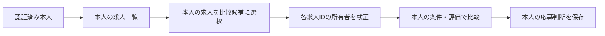

# MeTeA 求人一覧・求人確認・求人比較仕様

> 最新状況（2026-09-10）：Google認証・Neon保存・運営者機能を公開環境へ反映済み。本人ログイン、保存、公開サーバー再起動後の復元を確認。2人目の実アカウント検証は未実施。以下の過去の「公開未反映」記録から進捗があるため、[公開反映・受入確認](public_release_status.md)を現在の確認状況の正とする。

## 1. 位置づけと原則

本書は「② 求人を比較する」配下にある求人一覧、求人確認・AIマッチング詳細、求人比較画面の現行確定仕様を定める。求人登録は `job_registration_spec.md`、評価計算は `job_ai_matching_spec.md` を正本とする。

- AIは応募先を決定せず、利用者が求人の違いと根拠を理解して判断できるよう支援する。
- 「AIマッチ度の高い求人」は応募推奨ではなく、現時点の登録情報との適合度が高い求人である。
- 強調表示は最大3件とし、専用のおすすめ一覧画面は設けない。
- AI評価、評価根拠、求人原情報、応募判断は役割を分けながら1つの求人確認画面へまとめる。
- AI評価が完了するまで、求人確認画面の本体と比較画面には当該求人を表示しない。
- 背景、カード、フォント、ボタン、SVGアイコンおよび色はトップ画面で確定したMeTeA共通デザインに合わせる。

## 2. 画面構成

```text
求人一覧
├─ 求人を登録する → 求人登録
├─ AIマッチ度の高い求人（最大3件）
├─ 検索・絞り込み・並び替え
├─ 会社名 → 求人確認・AIマッチング詳細
└─ 2～3件を選択 → 求人比較

求人確認・AIマッチング詳細
├─ AIマッチング結果
├─ マッチング詳細
├─ 求人詳細
└─ 応募判断
```

## 3. 求人一覧

### 3.1 役割と導線

登録済み求人の検索、管理、比較対象の選択および個別確認の起点とする。画面上部に「求人を登録する」、画面下部に共通アウトラインボタン「← トップへ戻る」を表示する。

通常一覧から求人確認画面へ進む主導線は会社名だけに設定する。求人名、応募判断タグ、行全体には同じ遷移を重複設定しない。

会社名から詳細へ進めること、およびチェックした2～3件を比較できることを白い使い方案内カードで説明する。警告色や絵文字は使わず、専用SVGを使用する。

### 3.2 AIマッチ度の高い求人

評価完了済みで有効な求人から、総合マッチ度の高い順に最大3件表示する。

- 順位
- 会社名
- 求人名または募集ポジション
- AI総合マッチ度と星表示
- 希望条件
- 就活の軸（確定軸と仕事の進め方を含む）
- 職務経歴・スキル
- 求人側応募必須条件
- 評価カバー率
- 暫定評価かどうか
- 「詳細を見る」

評価カバー率が100%未満の場合は「暫定評価」と表示し、薄い青またはグレーのステータスタグを使用する。評価情報の案内には絵文字やテキスト記号ではなく共通SVGを使用する。

### 3.3 評価完了前と完了通知

評価が存在しない、待機中、評価中、再評価待ち、失敗、または旧版キャッシュの求人は上位3件へ含めない。通常一覧には求人情報を保持して表示するが、会社名リンクと比較チェックを無効化する。

求人一覧・比較・詳細では、処理中だけ3秒間隔で完了状態を確認し、結果の変化を同じ画面へ自動反映する。別画面へ自動遷移はしない。定期確認ではAIを呼ばず、未処理がなくなれば停止する。既存の比較結果は再評価中も前回の結果として表示する。失敗時は求人情報と前回結果を残し、明示的に再試行できる。

### 3.4 応募判断未対応の通知

応募判断が未対応の求人が1件以上ある場合だけ件数を表示する。0件の場合は通知領域自体を表示しない。この通知はAI評価とは別の管理情報である。

### 3.5 検索・絞り込み

検索語は会社名、求人名、職種、業種、都道府県、市区町村を対象とする。

絞り込み項目は次のとおりとする。

- 都道府県
- 市区町村
- 業種
- 紹介元
- 応募判断

市区町村は都道府県を1件選択した場合に、その都道府県に属する登録済み候補を表示する。複数都道府県の同時選択は設けない。紹介元は固定の経路種別ではなく、登録された紹介経路の具体名を候補として使用する。応募判断には「すべて」「未対応」と現行の応募判断5種類を使用する。

### 3.6 並び替え

- AIマッチ度順
- 未対応・登録が古い順
- 登録が新しい順
- 登録が古い順
- 年収下限が高い順
- 会社名順

年収は通常一覧へ表示しないが、並び替えには利用する。

### 3.7 通常一覧

比較チェック、会社名、求人名、職種、勤務地、AI評価、評価カバー率、応募判断、紹介元、編集、削除を表示する。求人IDと想定年収は表示しない。会社名を最も強い文字階層とする。

応募判断は淡い色のステータスタグとして表示し、タグ上では変更しない。求人票の編集・削除と応募判断は別機能とし、応募判断は求人確認画面で変更する。

評価完了済みの求人だけ比較対象にできる。比較件数は2件以上3件以下とし、件数外では開始できない。「選択をクリア」で全選択を解除できる。

## 4. 求人確認・AIマッチング詳細

### 4.1 表示可否と順序

有効な評価結果がある場合だけ本体を表示する。評価未完了のURLを直接開いた場合は状態案内と「← 求人一覧へ戻る」だけを表示し、失敗時は再試行も表示する。

表示順は、AIマッチング結果、マッチング詳細、求人詳細、応募判断、戻る導線とする。

### 4.2 AIマッチング結果

AI総合マッチ度、希望条件、就活の軸、職務経歴・スキル、求人側応募必須条件、評価カバー率、合っている点、懸念点、次に確認すること、AIコメントを表示する。

就活の軸35点は、確定軸25点分と仕事の進め方10点分の内訳を表示する。職務経歴・スキル25点は、業務経験の接続度10点分、ポータブルスキル10点分、実績・再現性5点分の内訳を表示する。

求人票に記載された内容だけを評価しており、人間関係や実際の企業文化など未記載事項は採点できないことを、オレンジ系の重要案内カードで示す。通常の補足より強く、入力エラーの赤とは区別する。

### 4.3 マッチング詳細

初期状態は折りたたむ。展開時は項目ごとに利用者条件、求人内容、判定、理由・根拠を表示する。判定は「一致」「一部一致」「不一致」「要確認」とし、判断材料がない場合は不一致にせず「要確認」とする。

### 4.4 求人詳細

概要を表示し、詳細は「求人詳細を見る」で折りたたみ展開する。AI評価と求人原情報を混在させない。

### 4.5 応募判断

選択肢は「応募する」「条件を確認して応募」「保留」「応募しない」「他経路から応募する」の5種類とする。次のアクション、期限、メモを任意入力できる。

「応募する」または「他経路から応募する」を保存した場合は応募管理へ自動連携する。他の3種類は判断だけを保存し、自動連携しない。

「他求人と比較する」から比較画面へ進める。戻るボタンは応募判断カードの外側に配置し、通常遷移では「← 求人一覧へ戻る」、比較から開いた場合は「← 比較結果へ戻る」とする。

## 5. 求人比較

求人一覧で選択した2～3件を横並びで表示する。比較中の会社名から求人確認画面を開く場合は選択求人IDを保持し、同じ比較結果へ戻れるようにする。

表示セクションは次の順とする。

1. AIマッチング比較
2. 基本条件
3. 勤務条件
4. 仕事内容・福利厚生
5. 比較のまとめ

ルール判定できる項目は「希望に一致」「一部一致」「希望と相違」「要確認」「評価対象外」で表示する。単純な優劣を付けない仕事内容・福利厚生等は原情報だけを表示する。

比較のまとめでは求人ごとに一致、一部一致、相違、要確認の件数を表示する。各判定の項目名は最大3件まで表示し、超過分は「ほか○件」とする。一致件数だけで応募先を決めず、相違内容と要確認内容も確認するよう案内する。

比較結果自体は保存しない。画面下部に「比較対象を変更する」と「求人一覧へ戻る」を表示する。

## 6. 共通デザイン

- ページ背景はトップ画面と同じ薄い青灰色、情報カード内部は白とする。
- 見出し、本文、補足文はトップ画面と同じフォントファミリー、太さ、文字色の階層を使う。
- 絵文字、Unicode記号、見出し横の鎖記号は使用せず、`assets` の専用SVGを使用する。
- 主要操作は青い塗りボタン、戻る操作は「←」を含む共通アウトラインボタンとする。
- 状態は淡いタグと文字で示し、強い緑・赤・オレンジを通常状態の主要面として使用しない。
- 警告、入力エラー、通常案内、完了通知は意味ごとに色とアイコンを分ける。

## 7. 採用しない仕様

- 独立したおすすめ求人一覧または「すべてのおすすめを見る」
- AIが応募可否を決定する表示
- 評価途中の求人確認画面
- 4件以上の同時比較
- 比較結果の永続保存
- 求人一覧上での応募判断変更


## 求人一覧・比較のアクセス範囲（2026-09-10更新）

一覧・詳細・比較対象・AI評価・応募判断を同じ本人のデータに限定する。URLや選択状態に他人の求人IDが入っても、本人の情報として取得・変更しない。アカウント切替では比較候補や選択中求人IDを引き継がない。



共通の認証・失効・データ分離仕様は[account_access_spec.md](account_access_spec.md)、設定手順は[google_login_setup.md](google_login_setup.md)を参照する。コード実装済みと公開検証済みは区別し、現時点ではOAuth設定・実Googleログイン・外部DBによる永続保存の検証が残る。


## 保存基盤のPostgreSQL対応（2026年9月10日）

本機能のRepositoryはSQLiteとPostgreSQLの共通接続境界を使用する。本人ID・親データの所有者チェックは両DBで維持する。保存先は`METEA_DATABASE_BACKEND`で明示選択し、外部DBの接続失敗時にSQLiteへ戻さない。As-Is／To-Be、移行・バックアップ、検証範囲は[保存設計](storage_persistence_spec.md)を参照する。公開環境への反映は別途必要である。


## 2026年9月10日：運営者確認・出力とデータ説明

As-Is：本人用画面とバックアップCLI。今回：通常利用者の分離を維持したまま、運営者に限り利用者別の保存データ確認・CSV/JSON出力を追加した。この機能の保存内容も対象となる。ログイン前・設定画面に保存情報と利用目的、外部送信の説明を追加した。To-Be：公開設定の反映と、別の実Googleアカウントを含む受入確認。詳細は[運営者データ設計](operator_data_spec.md)を参照。


## 初回招待コード方式への変更

メール事前登録から、Googleログイン後の初回招待コード入力へ変更する。通常利用者の所有者チェックと運営者専用権限を維持する。As-Is/To-Beと確認範囲は[招待コード設計](invite_code_spec.md)を参照。


## 2026年9月10日：変更時のAI再評価と結果の自動反映

| 観点 | As-Is（今回の修正前） | To-Be（今回実装） |
|---|---|---|
| 変更のない比較表示 | 保存済みAI評価を使用 | 維持。状態確認だけでAIは呼ばない |
| 再評価開始 | 一覧の求人IDリストの変化に依存 | 一覧・比較・詳細の表示時に未処理を投入 |
| 複数件の処理 | 先頭3件が処理中・失敗だと後続が待ち続ける可能性 | 登録できた件数で上限を数え、ワーカー終了時に次のバッチを投入 |
| 結果反映 | 次の画面実行まで待機 | 処理中だけ3秒間隔で本人のDB状態を確認し、変化時に画面更新。待ちがなくなると停止 |
| 処理中の追加変更 | 結果保存で変更フラグが消える可能性 | 開始時に既存フラグを消費し、開始後の変更フラグは結果保存でも保持して再評価 |
| 求人詳細 | 評価未完了だと画面全体を非表示 | 求人内容を表示し、前回の評価があれば保持 |

AIモデル・プロンプト・採点基準は変更しない。失敗は無限に自動再試行せず、画面の再試行操作で復旧する。入力変更のない完了結果は通常のキュー登録でも再評価しない。求人編集は保存前後の内容が異なる場合だけ再評価待ちにする。

実装：`ui/job_evaluation_progress.py`、`services/job_matching_auto_evaluation_service.py`。監視はStreamlitのfragmentを使用する（[公式仕様](https://docs.streamlit.io/develop/api-reference/execution-flow/st.fragment)）。定期確認時は本人の状態のみ取得し、完了等の変化時に全画面を再実行する。認証・所有者チェックは維持する。

確認：隔離SQLiteとモックで変更検知、処理中変更の保持、重複抑止、後続キュー、監視でAIを呼ばないこと、停止、本人分離を検証。公開環境での実AI完了時間・画面への自動反映、フォーム編集中の操作、アプリ再起動で中断された既存キューの復旧は別途確認が必要。再起動を越える永続ジョブキューは今回追加しない。


## 白画面の待ち時間と携帯対応の確認（2026年9月10日）

As-Is：サービスのimport・認証・DB処理が最初の描画より先にあり、求人画面では監視と本文・詳細が同じ評価を重複取得していた。
To-Be（今回実装）：起動直後と画面読込中に案内を表示する。求人画面ではナビゲーションを先に描画し、1回取得した本人の評価を同じ描画内で再利用する。処理待ちがなければキュー確認用・監視用の追加DB読込を行わない。ページ間・利用者間の共通データキャッシュは追加しない。AIモデルと評価条件は維持する。

公開サービスが休止している間やPythonが動き始める前の待機は、この案内だけではなくせない。秒数の短縮幅は未計測。処理中の完了監視は引き続き3秒間隔で行う。

携帯対応のAs-Is：900px以下で求人詳細の評価行を縦並びにするCSSはある。一方、求人比較はコンテンツ最小幅960pxを強制し、共通サイドメニューは非表示となる。全画面が携帯対応済みとは扱わない。
携帯対応のTo-Be（未実装）：携帯用メニュー、比較部分に限定した横スクロールまたは求人別カード、360〜430px幅での入力・応募管理・比較の操作確認。今回の修正は待ち表示と読込削減であり、携帯レイアウトの変更・実機検証は含まない。


## 携帯表示とLINE共有（2026年9月10日追加）

| 対象 | As-Is（変更前） | To-Be（今回実装） |
|---|---|---|
| 共通メニュー | 900px以下で非表示 | 共通ナビを使う画面に開閉式「MeTeA メニュー」を表示。ホーム・求人・応募管理・設定等へ移動可能 |
| 比較画面 | 画面全体の最小幅960px | ページは端末幅。比較表だけ横スクロールし、項目列を固定。求人番号で各表と企業を対応付け |
| 比較サマリー | 複数列 | 携帯幅では1列 |
| LINEからの利用 | 専用案内なし | ログイン前にSafari／Chromeで開く案内とコピー用の公開URLを表示 |

共有するURLは `https://metea-job-support.streamlit.app/`。特定の求人ID・他人の入力情報・招待コードをURLに含めない。招待コードは送付用の文面にのみ含め、リポジトリには保存しない。LINEへの自動送信は行わない。

確認範囲：実装から出力したナビ・3求人の比較HTMLを、Edgeで360・390・430・1280px幅で描画。携帯幅でページ全体の横はみ出しがないこと、メニューの開閉・リンク表示、表内スクロール、PCでは携帯メニュー非表示を確認。これは画面部品の検証であり、全画面の実機検証・LINE内からのGoogleログイン成功確認ではない。入力画面・応募管理を含む携帯実機での受入確認は残る。

Googleログインは埋め込みブラウザで制限される場合があるため、Safari／Chromeへ案内する。[Googleの説明](https://developers.googleblog.com/en/upcoming-security-changes-to-googles-oauth-20-authorization-endpoint-in-embedded-webviews/)。iPhone/iPadではLINEの標準ブラウザ設定も利用できる：[LINE公式ヘルプ](https://help.line.me/line/smartphone?contentId=20023875&lang=ja)。アプリから外部ブラウザへの強制遷移は実装しない。

## 2026-09-13 最寄駅未登録時の通勤確認

As-Is：求人の最寄駅がないと通勤時間の入力ができなかった。To-Be：本人が実際の勤務地住所を入力し、Googleマップで経路を確認して電車移動時間を保存できる。保存値はAI評価・求人比較で共通利用する。住所から時間を自動取得するAPIは追加していない。保存仕様・互換性・検証範囲は job_commute_spec.md を参照。

## 2026-09-13 確認結果の操作

As-Is：企業・求人元への確認項目は確認不要への移動のみ。
To-Be：求人詳細の評価一覧内で、各項目の「確認結果を入力・編集」から内容を保存できる。確認済みの追加情報に保存内容を表示し、後から編集・取り消し可能。保存内容は求人の補足情報としてAIへ渡り、当該求人の評価が自動更新される。確認不要の操作は維持。入力途中はフォーム内に保持し、保存時に送信する。

## 2026-09-13 確認結果の選択式入力

As-Is：確認結果は全項目が自由記述だった。
To-Be：転勤条件、シフト勤務、夜勤、雇用形態、休日形態、在宅勤務等の定型項目は選択式。選択肢には確認できなかった・その他を含める。残業時間（月平均時間）・年間休日数（日/年）・年収（万円/年）・電車移動時間（片道分）は数値入力。始業・終業は時刻選択。定型化していない項目は自由記述を維持する。

全項目で必要な補足を記載可能。未入力は「なし」や0と扱わず、未選択・未入力の状態で表示する。旧自由文を勝手に選択肢へ分類せず補足に保持し、変更せず保存できる。既存保存形式result_textを維持し、画面で入力した値を項目名・単位付きの文章へ変換する。DB・再評価条件は変更しない。関連12件で選択・数値・時刻の復元、旧文章保持、未入力扱い、保存操作、既存の保存と評価反映を確認。

追加：公開評価にある「土曜日休日希望」「服装・髪型自由希望」も選択式に対応。その他・確認できなかったの選択肢と補足欄を共通で用意する。

## 2026-09-13 確認操作をページ内更新へ変更

As-Is：確認不要・復元・確認結果保存・取り消しがst.rerun()でページ全体を再実行し、初期読込と遷移待ち案内が出ていた。
To-Be：求人詳細のAI評価・詳細一覧・確認操作を1つのfragmentへまとめる。上記操作は当該領域だけ更新し、求人詳細全体の初期取得やURL変更を行わない。確認結果と評価だけを再取得し、既存評価を表示しながら当該求人を更新する。画面遷移バナーはこの領域のボタンでは出さず、実際のリンク遷移では維持する。

AI処理中だけ3秒間隔の部分更新を予約し、完了時に停止する。入力欄にフォーカスがある間は更新を待つため、選択肢や入力途中の文章を閉じない。待機中のDBポーリングは行わない。フォーム・保存データ・判定基準は変更しない。

## 2026-09-13 確認結果保存後の入力位置維持

- As-Is：部分更新は実装済みだったが、保存後の項目移動と折りたたみ再生成による表示位置の維持が不十分だった。公開で先頭へ戻ったとの報告あり。
- To-Be：評価詳細と各確認フォームに固定キーを付け、処理中案内の配置を固定する。保存直前に開閉状態と次の確認フォームを記録し、更新後は次の入力項目が見える位置を保つ。次のフォームがない場合は現在のフォーム位置を使う。
- 保存結果の確認済み欄への移動、選択肢、AI採点方法は変更しない。スクロール・タッチ操作を始めた場合は位置復元を取り消す。

## 2026-09-13 確認結果の一括保存

| 対象 | As-Is | To-Be（実装） |
|---|---|---|
| 保存操作 | 各項目に保存ボタンがあり、都度評価更新 | フォーム最下部の「確認結果をまとめて保存・評価を更新」一つに統合 |
| 確認不要・復元・取消 | 各操作が即時保存 | チェックで指定し、結果入力と同時に保存 |
| DB保存 | 一項目単位 | 全件を事前検証し、一つのトランザクションで保存。失敗時は全件ロールバック |
| 未入力・変更なし | 項目ごとに処理 | 未入力は既存データを維持。同一内容は更新・再評価しない |
| AI更新 | 項目ごとに更新要求 | 保存した確認情報に変更があった場合、当該求人の評価を一度だけ無効化しバックグラウンド評価へ |
| 入力中の画面 | 評価更新が確認フォームにも及ぶ | スコア・評価一覧・フォームを独立したfragmentに分離。評価更新ではフォームを描き直さない |

入力欄の並びは、そのページを開いている間は維持する。保存後は件数を表示し、確認済み・確認不要の欄への分類し直しは次にページを開いたときに反映する。これにより未入力欄や続けて編集中の値が、AI完了によって移動・消失しない。既存の選択肢・数値・時刻・補足欄は維持。最後のボタンを押すまで保存されない旨を明示する。

保存完了のDOM通知を評価側が検出してDBを読み直し、処理中のみ約3秒ごとに状態を取得する。入力フォーカス時は完了確認を延期。通知監視はブラウザ内のみでDB・AIを呼ばない。AI一回自体の応答時間短縮を保証する変更ではない。

### 2026-09-13 一括保存化に伴うカード装飾の復元

一括フォームへ移す際に企業確認カードのスタイル用キーと見出しクラスが欠落し、項目ごとの枠とフォーム外枠が増えていた。既存キー・見出しを復元し、企業確認の薄いオレンジ背景と上線、プロフィール確認の青いカード、項目間の区切り線を維持する。送信範囲を束ねるフォーム自体は透明・枠なしとする。一括保存・入力形式・部分更新の処理は維持。

### 2026-09-13 企業確認項目の選択式補完

As-Is：土曜日休日希望・服装髪型自由希望には選択肢があったが、AIの表示名「土曜日」「服装・髪型自由」では自由文へ戻っていた。
To-Be：表示名の別名にも既存候補を適用し、未経験・第二新卒の応募可否、老舗・安定企業の設立からの年数に候補を追加。年数のみで経営の安定性は断定せず、経営情報は補足する。個別候補がない項目も「確認できた（補足に記載）／確認できなかった／その他（補足に記載）」から選択。確認できた・その他では具体的な補足を必須にし、単なる確認済みを条件一致と扱わない。

残業時間・年収等は正確な数値入力、時刻は時刻入力を維持。選択の初期値は未選択。既存の自由文は「その他」の補足として完全に保持し、保存形式・一括保存・カードデザインを維持する。

### 2026-09-13 一括保存後の表示反映修正

前項の「分類し直しは次回アクセス時」は廃止。保存成功時に限り確認レコードを再取得し、詳細fragmentを一度更新して、確認不要・確認済み・復元・取消を直ちに表示へ反映する。保存済みの操作チェックは消去し、次回送信へ持ち越さない。入力値のキーは保持。AIの定期更新からのフォーム分離は維持。保存クリック時のスクロール位置を保持し、全ページの先頭へ戻さない。
