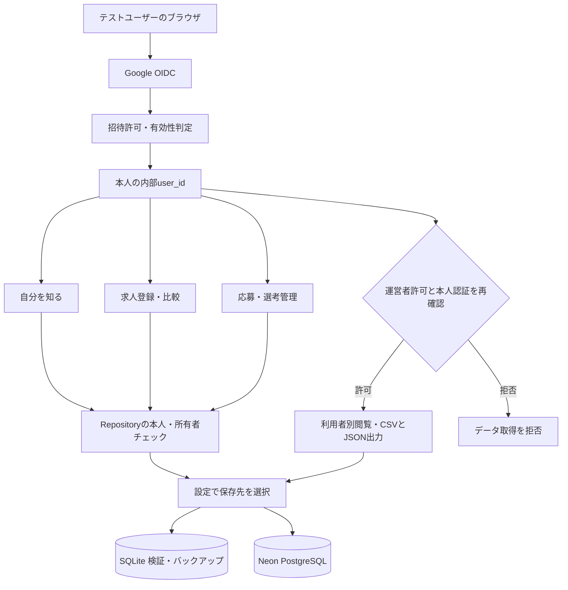

# MeTeA 全体仕様

> 最新状況（2026-09-10）：Google認証・Neon保存・運営者機能を公開環境へ反映済み。本人ログイン、保存、公開サーバー再起動後の復元を確認。2人目の実アカウント検証は未実施。以下の過去の「公開未反映」記録から進捗があるため、[公開反映・受入確認](public_release_status.md)を現在の確認状況の正とする。

## 1. この文書の位置づけ

この文書は、MeTeA全体の目的、求人機能の役割、主要な画面構成を定める。

詳細仕様は以下を参照する。

- 求人登録：`job_registration_spec.md`
- 求人機能UI/UX・求人比較：`job_comparison_spec.md`
- AIマッチング：`job_ai_matching_spec.md`
- 応募後管理：`application_management_spec.md`

本仕様書および詳細仕様は、現行実装を基準として記述する。文書間で記述が競合する場合は、対象機能の詳細仕様を優先し、それでも判断できない場合は現行コードおよびDBスキーマを正とする。

## 2. 基本思想

MeTeAは、AIが応募先を決定するのではなく、利用者が自分で応募判断できるよう支援する。

AIは、求人と利用者の希望条件、本人が確定した就職活動の軸、職務経歴、スキル等を分析し、適合度、一致点、懸念点、確認事項を提示する。利用者はAIの評価根拠と求人情報を確認し、必要に応じて複数求人を比較したうえで、最終的な応募判断を行う。

## 3. 求人機能の画面構成

### 3.1 求人一覧（管理画面）

登録済み求人の管理、検索、絞り込み、並び替え、比較対象の選択、現在の応募判断の確認を行う。

画面上部には、最新情報による適合度を基準とした「AIマッチ度の高い求人」を最大3件表示する。

TOP3には、AI総合マッチ度、マッチ度を示す星、カテゴリ別評価、評価カバー率および暫定評価かどうかを表示する。

独立した「AIマッチ度の高い求人」一覧や「すべて見る」導線は設けない。

通常の求人一覧から求人確認画面へ遷移する主導線は会社名に統一する。

応募判断は一覧上で現在値だけを表示し、変更は会社名から遷移した求人確認画面で行う。

求人票の編集・削除と応募判断の変更は、役割の異なる操作として分離する。

応募判断未対応の求人が1件以上ある場合に限り、画面上部へ未対応件数を通知する。

画面上部には、会社名から求人確認画面へ進めること、および2件から3件の求人を比較できることを説明する使い方案内を表示する。

### 3.2 求人詳細・AIマッチング画面

1つの求人について、次の情報と操作を1画面にまとめる。

1. AIマッチング結果
2. マッチング詳細（初期状態は折りたたみ）
3. 求人詳細（概要を表示し、「詳細を見る」で展開）
4. 応募判断

AIマッチング結果、マッチング詳細、求人詳細を完全に別画面へ分離しない。

応募判断も独立画面にはせず、この画面の最下部に配置する。利用者は「応募する」「条件を確認して応募」「保留」「応募しない」「他経路から応募する」から選択し、次のアクション、期限、メモを保存できるようにする。「応募する」または「他経路から応募する」を保存した求人は、応募管理へ自動連携する。

### 3.3 比較結果

求人一覧または求人詳細・AIマッチング画面の「他求人と比較する」から遷移する。

2件以上3件以下の求人を横並びで表示し、求人条件、AIマッチ度、希望条件との一致、就職活動の軸との一致、職務経歴・スキルとの適合などを比較する。

職務経歴・スキル25点は、業務経験の接続度10点、ポータブルスキル10点、実績・再現性5点に分けて評価する。異業種・異職種であること自体は減点せず、直接・類似経験、行動に裏付けられたポータブルスキル、成果の再現性を個別に確認する。

求人のAI評価はバックグラウンドで実行する。詳細画面全体をAI待ちで隠さず、前回結果があれば表示を続ける。一覧・比較・詳細は処理中だけ完了状態を定期確認し、結果の変化を自動反映する。別画面への自動遷移はしない。一覧の会社名リンク・比較候補の既存の完了判定は維持する。失敗時は情報を保持し、利用者が再試行できる。

比較結果はAIが選択すべき求人を決める画面ではなく、利用者自身が違いを把握して応募判断しやすくするための画面とする。

## 4. 主要導線

```text
求人一覧
├─ AIマッチ度の高い求人（最大3件）
├─ 検索・絞り込み・並び替え
├─ 会社名クリック
│    ↓
│  求人詳細・AIマッチング画面
│  ├─ AIマッチング結果
│  ├─ マッチング詳細
│  ├─ 求人詳細
│  └─ 応募判断
│       └─ 他求人と比較する → 比較結果
│
└─ 比較対象に選択 → 比較する → 比較結果
```

比較結果から元の求人へ戻り、改めて応募判断できるようにする。

## 5. AI評価の原則

- AIマッチ度順は応募推奨順ではなく、希望条件・就職活動の軸・職務経歴等との適合度順とする。
- AI評価には、その時点の最新の利用者情報と求人情報を使用する。
- AIマッチング結果は評価キャッシュとしてDBへ保存し、求人一覧、求人確認画面および比較結果画面で共通利用する。
- 利用者情報または求人情報が変更された場合は、関係する評価キャッシュを再評価待ちにする。
- 再評価待ちの求人は求人一覧の表示時に最大3件ずつバックグラウンド評価キューへ追加する。
- 有効な評価キャッシュがある場合は、画面を表示しただけではAI評価を再実行しない。
- 評価カバー率が100%未満の場合は暫定評価として表示する。
- AIは適合度だけでなく、一致点、懸念点、確認事項、評価理由を提示する。
- 求人票に情報がない場合は不一致とせず、「確認が必要」として区別する。
- 必須条件が不一致でも候補から自動除外せず、強い警告を表示する。
- AIは応募判断を決定しない。最終判断は利用者が行う。

## 6. 求人登録と応募後管理の分離

- 求人登録は、求人情報と、その求人を受け取った紹介経路を管理する。
- 応募判断・応募後管理は、実際に応募した経路、選考状態、結果等を管理する。
- 求人を保存しただけでは応募済みとして扱わない。
- 同じ求人を複数経路から受け取っても、求人本体、紹介経路、実際の応募経路を区別する。
- 別の紹介経路を追加しても、既存の応募判断や選考状態を自動変更しない。

## 7. 紹介経路の管理

求人1件に複数の紹介経路を紐づける。経路種別に加えて、転職エージェント名や求人サイト名などの具体名を保持し、検索・絞り込み・詳細確認に利用する。

実際に応募した経路は、求人の紹介経路一覧とは別に、一意に特定できる形で応募活動へ記録する。

## 8. 採用しない構成

- 独立した「AIマッチ度の高い求人」一覧画面
- 「すべて見る」導線
- AIマッチ度の高い求人を大量に強調表示する機能
- 独立した「応募判断」画面
- AIマッチング結果の中に利用者の判断入力を混在させる構成

## 9. 実装上の責務分離

- 求人一覧：管理、検索、絞り込み、並び替え、TOP3、比較の起点
- 求人詳細・AIマッチング：1求人のAI評価、根拠、求人情報、応募判断
- 比較結果：2件以上3件以下の横並び比較
- 求人登録時の差分比較：既存求人と入力内容の更新差分確認

求人登録時の差分比較に使う `services/job_service.py` の `compare_jobs()` は、複数求人の比較には流用しない。

## 10. リリース対象外の将来機能

- 駅すぱあとAPIを利用した電車移動時間の自動算出は将来機能とし、現行リリースでは手動入力・手動確認を使用する。

## 10.1 応募後管理の画面構成

応募後管理は、独立した応募詳細画面を設けず、応募管理画面を中心に構成する。

- 選考スケジュールの操作列にある「予定・結果を更新」から、同一画面内の「選考予定・結果を登録」ダイアログを開く。「次の予定・期限」は確認用表示とする。
- ダイアログでは、予定、完了、延期、中止、日程変更、選考結果および次回選考を登録する。
- 現在フェーズは登録された事実から自動更新し、実態と異なる場合だけ補助操作で手動修正する。
- 選考結果が通過で次回選考が登録された場合は、次回マイルストーンを自動作成または更新する。
- 選考準備はダイアログへ統合せず、選考スケジュールの操作列にある「選考準備」から独立画面を同一タブで開く。
- 選考準備内の「選考別準備」「企業別準備」「共通準備」は、別タブやURL遷移を使わず同一画面内で切り替える。
- 選考スケジュールは週、2週間、1か月表示を切り替え、自分の準備、エージェント連絡、企業・選考、完了実績および期限超過を区別して表示する。
- 旧応募詳細 URL は互換入口として応募管理画面へ接続する。
- 絞り込み、表示切替およびダイアログ操作で、同じ画面を別タブに開かない。

詳細は [application_management_spec.md](application_management_spec.md) を正本とする。

## 11. 「自分を知る」の入力フロー

「自分を知る」の画面、入力、保存、確認・編集、エラー表示およびレスポンシブ表示の詳細は、[self_discovery_spec.md](self_discovery_spec.md)を正本とする。本章はプロダクト全体との接続関係および概要を定義し、詳細が異なる場合は専用仕様書を優先する。

利用者情報は、以下の5画面を順番に入力する。

```text
基本情報
  ↓
希望条件
  ↓
価値観
  ↓
就職活動の軸（候補を確認・修正して確定）
  ↓
職務経歴・スキル
```

- 各画面に現在位置を `1 / 5` から `5 / 5` で表示する。
- 正式保存後は次の画面へ進み、2画面目以降は直前の画面へ戻れるようにする。
- 希望条件と価値観の入力内容から、アプリが就職活動の軸候補を最大3件作成する。
- 候補は自動確定しない。利用者が名称、具体的な判断基準、優先順位を確認・修正したうえで確定する。
- 軸の名称と具体的な判断基準は必須とし、空欄の軸は追加、編集完了または正式確定できない。
- 候補の再生成、追加、編集、並び替え、削除は画面上の未確定内容および下書きだけを更新し、正式保存済みの軸を変更しない。
- 正式保存は、利用者が「この内容で確定して次へ」を押した場合に限って行う。
- 具体的な判断基準が未入力の軸は確定できない。
- 既に確定した軸がある場合、希望条件や価値観を再入力しても自動上書きしない。
- 利用者が「入力内容から軸候補を作り直す」を明示的に選び、確認操作を行った場合に限り、画面上の軸を最新の入力内容から作成した未確定候補へ置き換える。
- 再生成した候補は、利用者が確定操作を行うまでは正式保存しない。
- 就職活動の軸は最大3件とし、各カードに順位、名称、具体的な判断基準、作成元を表示する。
- 自動提案する軸の名称は、入力された場面や状態の名称をそのまま表示せず、「何を大切にし、どのような働き方または環境を実現したいか」が単独で読んでも分かる方針文とする。定型候補と自由入力から作る候補のいずれも、原則として「〜を実現する」の文型へ正規化する。
- 順位変更、編集、削除の操作は、文字記号だけではなく意味が分かるアイコンと日本語ラベルを組み合わせて表示する。
- 価値観の回答は軸候補を作る材料として利用し、AI総合適合度では独立して採点しない。
- 価値観画面の「仕事の進め方」は、左右の考え方に対する近さを1から5で回答する。初回表示ではいずれの値も選択済みにせず、利用者が各質問へ明示的に回答する。
- 「3（どちらともいえない）」は通常の回答として選択できるが、初期値として自動設定しない。
- 保存済み回答がある場合だけ、その回答を選択状態として復元する。全質問を必須とし、未回答がある場合は該当カードを強調して次画面へ進まない。
- AI総合適合度では、利用者が確定した就職活動の軸だけを採点し、価値観との二重採点を行わない。
- 通常の入力動線には、独立した「転職理由」画面を含めない。
- 旧 `job_change_reason` URLは互換性のため受け付け、希望条件画面へ転送する。
- 転職理由・退職理由は、応募管理の「選考準備」における共通準備テーマとして扱う。

### 11.1 共通UI方針

- 「自分を知る」の5画面は、TOP画面を基準に同一のデザイントークンを使用する。
- TOP画面の主機能カードは「① 自分を知る」「② 求人を比較する」「③ 応募後を管理する」「④ 活動を振り返る」とする。「④ 活動を振り返る」は `assets/analytics.svg` を使用し、選考通過率レポートへ遷移する。レポートは「全体サマリー」と「経路・業種・職種別分析」の2ビューで構成し、同一画面内で切り替える。設定はTOP画面上部のナビゲーションから開く。
- 共通サイドナビゲーションの「③ 応募後を管理する」配下は、1番目を「応募管理」、2番目を「選考準備」とする。「予定・マイルストーン」および「活動履歴」は独立した常設メニューとして表示しない。共通ナビゲーションから選考準備を開いた場合は応募企業を選択し、応募管理の企業行からは対象企業の準備を直接開く。「④ 活動を振り返る」配下は「選考通過率レポート」とする。この構成を共通ナビゲーションがある全画面へ適用する。
- 求人・応募・登録内容確認・設定・ヘルプ等の管理／閲覧画面は、同一の共通サイドナビゲーション部品を使用する。詳細画面では所属する一覧メニューを選択中として表示し、設定・ヘルプでは該当する補助メニューを選択中として表示する。リンクは同一ブラウザータブで開く。
- TOP画面は主機能カードを入口とする専用ナビゲーション、「自分を知る」の5画面は入力順序を示す5段階ステッパーを使用する。入力画面へ共通サイドナビゲーションを重ねず、ステッパーの現在ステップを現在地表示とする。
- 画面外側は薄い青灰色、主要な入力領域は白いカードとして明確に分離する。
- 見出し、説明文、進捗表示、入力欄、展開パネル、案内表示の文字階層と余白を統一する。
- 必須入力に不備がある場合は、画面上部のエラー一覧、対象入力欄の赤枠、入力欄直下の個別メッセージを組み合わせて表示し、次画面へ進ませない。
- PC表示では主要カードが画面幅に追従し、スマートフォン表示では一列へ変化するレスポンシブレイアウトを採用する。
- 主操作はMeTeAブルーの塗りボタン、戻る・一時保存等の補助操作は白地に青枠のボタンとする。
- 色、フォント、余白、カード、入力欄、ボタン、通知、角丸、境界線および影は共通デザイントークンで管理する。画面固有CSSは共通トークンを参照し、同じ意味の色や寸法を画面ごとに再定義しない。
- 共通ナビゲーション、入力エラー一覧、項目別エラー、保存失敗および操作完了通知は再利用部品として提供する。画面固有の保存・入力・AI解析処理と、共通の表示部品を分離する。

#### 登録内容の確認・編集

- TOP画面の「① 自分を知る」は、他の主機能カードと同じ1カード・1導線のデザインを維持し、「自分を知る」の入口画面へ遷移する。
- 「自分を知る」の入口画面には、利用者の操作を表す「① 自分の情報を登録する」と「② 登録した内容を見直す」の2つのカードを横並びで表示する。「① 自分の情報を登録する」は基本情報から職務経歴・スキルまでを順番に登録する既存の入力フロー、「② 登録した内容を見直す」は登録済み情報のカテゴリ選択・編集画面へ遷移する。
- カテゴリ選択画面では、基本情報、希望条件、価値観、就活の軸、職務経歴・スキルの登録状態と概要を表示する。
- カテゴリカード全体を一つの遷移操作として扱い、カード内に重複する「確認する」ボタンは置かない。トップ画面と同様に、左側へカテゴリのアイコン、中央へ名称・説明・登録状態、右側へ遷移を示す矢印を配置する。
- 各カテゴリを選択すると、そのカテゴリの正式保存済み情報をカード型ダッシュボードで表示する。
- ダッシュボード上部には、そのカテゴリ全体およびカード群ごとの回答済み件数を `回答済み件数 / 全項目数` 形式で表示する。詳細情報は意味のまとまりごとにカードへ分割する。
- 編集操作はカードごとに提供する。編集時は別画面・別タブへ遷移せず、現在画面上に対象カード専用のモーダルダイアログを開く。
- 保存時は既存の入力確認・正式保存処理を利用し、内容が実際に変更された場合は既存のAI評価を再評価待ちにする。
- 職務経歴はAI取込・手入力の登録方法にかかわらず、正式保存後は同じ確認画面で扱う。会社を親カード、所属する部署・役割を子カードとして表示し、それぞれカード単位で編集できる。確認画面からPDF・Word取込画面へ戻る補助導線を提供する。
- 未登録カテゴリには登録状態と入力画面への導線を表示する。
- PCではカテゴリカードを横並び、狭い画面では二列または一列へ変化させる。色、文字、角丸、枠線、影および通知は「自分を知る」の共通UIへ統一する。

#### 操作結果とメッセージの共通表示

この表示方針は「自分を知る」に限らず、求人管理、応募管理、選考準備その他の全画面へ適用する。

- 保存、更新、コピー、一時保存、削除等が正常に完了したことだけを伝えるメッセージは、一時的な通知として表示する。
- 一時通知は画面本文の高さやボタン周辺の余白を変化させず、一定時間後に消える表示とする。
- 「保存しました」等の操作完了メッセージを、画面下部へ通常テキスト、情報表示または成功表示として残し続けない。
- 保存後に次画面へ遷移する場合は、遷移先で一度だけ一時通知を表示する。
- 入力エラー、保存失敗、警告、未確認事項など、利用者の判断または対応が必要なメッセージは一時通知にせず、対象画面内へ継続表示する。
- 保存失敗は赤系の共通通知で「何を保存できなかったか」と「次に行う操作」を表示する。入力中の値および保存前の既存データを消去せず、内部例外や技術的なエラー文字列を利用者へそのまま表示しない。
- 必須入力エラー一覧の見出しは「入力内容を確認してください」に統一する。同じ文言は一覧内で重複させず、項目直下ではその項目を修正するための具体的な文言を表示する。
- 求人登録完了画面、プロフィール登録完了状態、AI評価状態、通勤時間の確認状態など、画面そのものが完了結果または現在状態を示す場合は常設表示を使用する。
- 同じメッセージを一時通知と画面内表示の両方へ重複表示しない。

### 11.2 基本情報画面

#### 11.2.1 入力項目

基本情報では、次の項目をすべて必須入力とする。

- 姓
- 名
- 性別
- 生年月日（年・月・日）
- 都道府県
- 市区町村
- 現在の最寄駅
- 現在の最寄駅の識別情報

現在の最寄駅は、利用者が入力した駅名を検索し、表示された候補から選択する。駅名の文字列だけを入力した状態では正式な選択完了としない。選択した駅名と識別情報は、勤務地の最寄駅までの電車移動時間を確認・評価するために使用する。徒歩時間は含めない。

#### 11.2.2 入力確認とエラー表示

「次へ」を押した時点で必須入力および入力値の妥当性を確認する。エラーが1件以上ある場合は基本情報を正式保存せず、希望条件画面へ進まない。

エラー表示は次のとおりとする。

- 画面上部に「入力内容を確認してください」とエラー一覧をまとめて表示する。
- エラー対象の入力欄だけを赤枠および薄い赤背景で強調する。
- 対象入力欄の直下にも具体的なエラーメッセージを表示する。
- 正常な入力欄はエラー表示で強調しない。
- エラーメッセージと次の入力項目が重ならない表示領域と余白を確保する。
- 生年月日の組み合わせが不正な場合は、年・月・日の入力欄を一つの対象として強調する。

#### 11.2.3 保存タイミング

基本情報は常時自動保存しない。利用者が「次へ」を押した時点で、現在の入力内容を下書き保存する。画面には「自動保存済み」等の自動保存を示す文言を表示しない。

入力確認に成功した場合は基本情報を正式保存し、希望条件画面へ進む。入力確認に失敗した場合は下書きを保持し、同じ画面でエラーを修正できるようにする。下書き保存だけではAI評価キャッシュを再評価待ちにしない。正式保存された内容が保存前から実際に変わった場合だけ、既存のAI評価を再評価待ちにする。

#### 11.2.4 戻る操作

- 基本情報画面の「戻る」はTOP画面へ遷移する。
- 希望条件以降の「戻る」は、原則として直前の「自分を知る」入力画面へ遷移する。
- 戻る操作では正式保存を実行しない。

#### 11.2.5 レスポンシブ表示

- PCでは利用可能なブラウザ幅に応じて白い入力カードの幅を調整し、主要入力から「次へ」までを見渡しやすい密度で表示する。
- PCの表示倍率100％を基準とし、カード外枠が画面から不自然に見切れないようにする。
- 画面幅が狭い場合は左側の入力ステップを非表示にし、入力カードへ利用可能な横幅を割り当てる。
- スマートフォンではカードの固定高さを解除し、画面全体を自然に縦スクロールできるようにする。
- フォントはTOP画面と同一の日本語フォントスタックを使用する。
- 主操作の「次へ」はMeTeAブルーの背景と白文字、補助操作の「戻る」「駅を検索」は白背景と青枠で表示する。

### 11.3 希望条件画面

#### 11.3.1 最低限の必須入力

後続の求人比較およびAIマッチングで、仕事内容、勤務地、年収、雇用形態という主要な比較軸を確保するため、次を必須入力とする。

- 希望職種：1件以上
- 希望都道府県：1件以上
- 最低許容年収
- 希望年収
- 希望する雇用形態：1件以上

必須入力項目には、基本情報画面と同じ赤い `*` を個々の入力欄へ表示する。折りたたみ見出しには、必須・任意を示す `★`、`☆` または赤い `*` を表示しない。

#### 11.3.2 優先度に応じた条件付き必須

次の項目は常時必須としない。利用者が対応する優先度を「必須」「希望」「許容」のいずれかに設定した場合だけ、評価に必要な値または選択内容を必須とする。「こだわらない」の場合は未入力を許可し、AIマッチングの評価対象外とする。

| 優先度を設定する対象 | 条件付きで必須となる値 |
|---|---|
| 通勤時間 | 片道通勤時間の上限 |
| 残業時間 | 残業時間の上限 |
| 始業時刻 | 希望始業時刻 |
| 終業時刻 | 希望終業時刻 |
| 年間休日数 | 希望年間休日数 |
| 休日条件 | 希望休日を1件以上 |
| 希望勤務地 | 選択した勤務地の優先度 |

条件付き必須が有効になった場合は、対象入力欄へ赤い `*` と必要性が分かる説明を表示する。

#### 11.3.3 任意入力

次は任意入力とする。未入力の場合は、該当項目を評価対象外または未設定として扱い、未入力だけを理由に求人を不一致としない。

- 希望業種
- 希望市区町村
- 理想年収
- 働き方・職場環境
- 入社可能日
- その他の希望業種・希望職種
- その他の希望・NG条件
- 希望する職場の年齢層

#### 11.3.4 年収入力

- 最低許容年収と希望年収は必須とする。
- `最低許容年収 <= 希望年収` となるよう入力確認する。
- 理想年収は任意とする。
- 理想年収を入力した場合は、`希望年収 <= 理想年収` となるよう入力確認する。
- 理想年収が未入力でも、最低許容年収と希望年収を使用して年収評価を行う。
- 理想年収を入力した場合だけ、求人年収が理想年収以上であることを上振れ情報として表示する。

#### 11.3.5 入力エラー

「保存して次へ」を押した時点で、常時必須項目、条件付き必須項目および値の整合性を確認する。エラーがある場合は正式保存せず、次画面へ進まない。エラー表示は基本情報画面と同じく、画面上部の一覧、対象入力欄の赤枠・薄い赤背景、入力欄直下のメッセージで示す。

### 11.4 職務経歴・スキル画面

- 入力方法は「PDFまたはWordの職務経歴書から取り込む」と「手入力する」から選択できる。
- PDFは文字情報を含むファイルを対象とし、ページ順に文字を抽出してAI整理へ渡す。画像だけのスキャンPDFから文字を取得できない場合は、文字を選択できるPDFへの変換を案内する。
- Wordは `.docx` を対象とし、段落および表の文字を文書内の順番で抽出してAI整理へ渡す。
- AIが整理した内容は自動確定せず、会社・部署・役割ごとに利用者が確認・修正してから保存する。
- AI取込内容の確認画面では、会社名、雇用形態、業種、会社の在籍期間に加え、部署・役割ごとの部署名、役職、職種、担当期間、業務内容および実績・成果を表示し、保存前に修正できるようにする。
- AI取込の確認中は登録済み会社一覧を同時表示せず、現在確認している会社、全体に対する確認進捗、保存またはスキップの操作を明確に表示する。
- 手入力およびAI取込のいずれも、会社名、業種、職種を必須とし、一つの会社につき部署・役割を1件以上登録する。
- 手入力では会社の在籍期間と、部署・役割ごとの担当期間を分けて入力する。部署異動や役割変更がある場合は、部署・役割ごとに開始年月、終了年月または「現在まで担当」を登録する。
- 会社および部署・役割の終了年月を入力する場合は、それぞれの開始年月以降であることを保存時に確認する。
- 手入力で「この会社を入力内容に追加する」を押した時点では、会社情報を画面内の下書きへ追加するだけとし、DBへ正式保存しない。利用者は全会社を確認画面で確認し、「この内容で登録する」を押した時点でまとめて正式保存する。
- 手入力の最終確認画面はAI取込後の確認画面と同じカード構成を使用し、会社単位の編集と追加を行えるようにする。
- 入力エラーは画面上部の一覧、対象入力欄の赤枠、入力欄直下の個別メッセージで表示する。
- 登録済み会社は、会社名と在籍期間を見出しとする折りたたみカードで表示し、展開後に詳細確認、編集、削除を行う。
- 最終確認画面では、登録企業数、部署・役割数および必須項目の入力状態を上部に表示する。会社ごとの折りたたみカード内に、会社情報、部署・役割、業務内容、実績・成果を区分して表示し、会社単位で入力画面へ戻って修正できるようにする。
- 登録完了通知は「自分を知る」の共通UIに従った青系の完了表示とし、標準の緑色通知は使用しない。
- 登録方法は入力途中でも切り替え可能とし、登録済みの会社情報を切り替え操作だけで削除しない。
- 画面幅、フォント、進捗表示、ボタン階層、カードの角丸・枠線・影、操作完了通知は「自分を知る」の共通UI方針へ従う。


## 全体の認証・データアクセス（2026-09-10更新）

Googleログインと許可メール・有効アカウント判定を全画面の前に置く。ログイン後は内部user_idを全機能で共通使用する。SQLiteとPostgreSQLを明示的に切り替える共通接続境界を実装。運営者専用の利用者別閲覧・CSV/JSON出力を実装済み。公開環境は未反映。



共通の認証・失効・データ分離仕様は[account_access_spec.md](account_access_spec.md)、設定手順は[google_login_setup.md](google_login_setup.md)を参照する。コード実装済みと公開検証済みは区別し、ローカルのOAuth設定・実Googleログイン・本人IDの登録を確認済み。公開環境の認証、複数の実アカウントでの分離、外部DBによる永続保存の検証が残る。


## 2026年9月10日：保存・復元の確認

実Google利用者ID 2で基本情報の下書きを画面から保存し、画面再読み込みとアプリプロセス再起動後の復元を確認した。別プロセスによる2利用者の永続保存・分離・未コミット変更の破棄も自動テストで確認済み。この時点の検証対象はローカルSQLite。以降のPostgreSQL対応・検証結果は保存設計を参照。公開環境の検証は別途必要。
基本情報の下書きは「次へ」の送信で保存される。送信前のキー入力のみの内容は保存保証の対象ではない。詳細とAs-Is／To-Beは[保存・外部DB移行設計](storage_persistence_spec.md)を参照する。

実ブラウザのタブを閉じ、新しいタブで再アクセスした後も下書きを復元できた。ブラウザアプリ全体の終了は未確認。確認用の下書きのみ削除し、確認前の未入力状態に戻した。

NeonのMeTeA用PostgreSQLをFreeプランで作成済み（Singapore、PostgreSQL 18）。接続情報のローカル設定とTOML形式確認は完了。PostgreSQL対応コードと実接続確認は完了。25テーブル1,276件の移行・全件照合とローカルアプリの切替を実施。詳細は保存設計を参照。公開切替は未実施。詳細は[外部DB移行設計](storage_persistence_spec.md)を参照。


## 2026年9月10日：運営者確認・出力とデータ説明

As-Is：本人用画面とバックアップCLI。今回：通常利用者の分離を維持したまま、運営者に限り利用者別の保存データ確認・CSV/JSON出力を追加した。この機能の保存内容も対象となる。ログイン前・設定画面に保存情報と利用目的、外部送信の説明を追加した。To-Be：公開設定の反映と、別の実Googleアカウントを含む受入確認。詳細は[運営者データ設計](operator_data_spec.md)を参照。


## 初回招待コード方式への変更

メール事前登録から、Googleログイン後の初回招待コード入力へ変更する。通常利用者の所有者チェックと運営者専用権限を維持する。As-Is/To-Beと確認範囲は[招待コード設計](invite_code_spec.md)を参照。


### 求人詳細のimportエラー対応

求人詳細のimport中にKeyErrorが発生した報告を受けた。画面遷移ごとのimportlib.reloadとファイル監視による再読込みが競合し得るため、通常importへ変更し、fileWatcherTypeをnone、runOnSaveをfalseにした。開発時もコード更新後はアプリを再起動する。同時import24回の検証は成功。公開での同一エラーの再発有無は区別して確認する。


## 2026年9月10日：変更時のAI再評価と結果の自動反映

| 観点 | As-Is（今回の修正前） | To-Be（今回実装） |
|---|---|---|
| 変更のない比較表示 | 保存済みAI評価を使用 | 維持。状態確認だけでAIは呼ばない |
| 再評価開始 | 一覧の求人IDリストの変化に依存 | 一覧・比較・詳細の表示時に未処理を投入 |
| 複数件の処理 | 先頭3件が処理中・失敗だと後続が待ち続ける可能性 | 登録できた件数で上限を数え、ワーカー終了時に次のバッチを投入 |
| 結果反映 | 次の画面実行まで待機 | 処理中だけ3秒間隔で本人のDB状態を確認し、変化時に画面更新。待ちがなくなると停止 |
| 処理中の追加変更 | 結果保存で変更フラグが消える可能性 | 開始時に既存フラグを消費し、開始後の変更フラグは結果保存でも保持して再評価 |
| 求人詳細 | 評価未完了だと画面全体を非表示 | 求人内容を表示し、前回の評価があれば保持 |

AIモデル・プロンプト・採点基準は変更しない。失敗は無限に自動再試行せず、画面の再試行操作で復旧する。入力変更のない完了結果は通常のキュー登録でも再評価しない。求人編集は保存前後の内容が異なる場合だけ再評価待ちにする。

実装：`ui/job_evaluation_progress.py`、`services/job_matching_auto_evaluation_service.py`。監視はStreamlitのfragmentを使用する（[公式仕様](https://docs.streamlit.io/develop/api-reference/execution-flow/st.fragment)）。定期確認時は本人の状態のみ取得し、完了等の変化時に全画面を再実行する。認証・所有者チェックは維持する。

確認：隔離SQLiteとモックで変更検知、処理中変更の保持、重複抑止、後続キュー、監視でAIを呼ばないこと、停止、本人分離を検証。公開環境での実AI完了時間・画面への自動反映、フォーム編集中の操作、アプリ再起動で中断された既存キューの復旧は別途確認が必要。再起動を越える永続ジョブキューは今回追加しない。


## 白画面の待ち時間と携帯対応の確認（2026年9月10日）

As-Is：サービスのimport・認証・DB処理が最初の描画より先にあり、求人画面では監視と本文・詳細が同じ評価を重複取得していた。
To-Be（今回実装）：起動直後と画面読込中に案内を表示する。求人画面ではナビゲーションを先に描画し、1回取得した本人の評価を同じ描画内で再利用する。処理待ちがなければキュー確認用・監視用の追加DB読込を行わない。ページ間・利用者間の共通データキャッシュは追加しない。AIモデルと評価条件は維持する。

公開サービスが休止している間やPythonが動き始める前の待機は、この案内だけではなくせない。秒数の短縮幅は未計測。処理中の完了監視は引き続き3秒間隔で行う。

携帯対応のAs-Is：900px以下で求人詳細の評価行を縦並びにするCSSはある。一方、求人比較はコンテンツ最小幅960pxを強制し、共通サイドメニューは非表示となる。全画面が携帯対応済みとは扱わない。
携帯対応のTo-Be（未実装）：携帯用メニュー、比較部分に限定した横スクロールまたは求人別カード、360〜430px幅での入力・応募管理・比較の操作確認。今回の修正は待ち表示と読込削減であり、携帯レイアウトの変更・実機検証は含まない。


## 携帯表示とLINE共有（2026年9月10日追加）

| 対象 | As-Is（変更前） | To-Be（今回実装） |
|---|---|---|
| 共通メニュー | 900px以下で非表示 | 共通ナビを使う画面に開閉式「MeTeA メニュー」を表示。ホーム・求人・応募管理・設定等へ移動可能 |
| 比較画面 | 画面全体の最小幅960px | ページは端末幅。比較表だけ横スクロールし、項目列を固定。求人番号で各表と企業を対応付け |
| 比較サマリー | 複数列 | 携帯幅では1列 |
| LINEからの利用 | 専用案内なし | ログイン前にSafari／Chromeで開く案内とコピー用の公開URLを表示 |

共有するURLは `https://metea-job-support.streamlit.app/`。特定の求人ID・他人の入力情報・招待コードをURLに含めない。招待コードは送付用の文面にのみ含め、リポジトリには保存しない。LINEへの自動送信は行わない。

確認範囲：実装から出力したナビ・3求人の比較HTMLを、Edgeで360・390・430・1280px幅で描画。携帯幅でページ全体の横はみ出しがないこと、メニューの開閉・リンク表示、表内スクロール、PCでは携帯メニュー非表示を確認。これは画面部品の検証であり、全画面の実機検証・LINE内からのGoogleログイン成功確認ではない。入力画面・応募管理を含む携帯実機での受入確認は残る。

Googleログインは埋め込みブラウザで制限される場合があるため、Safari／Chromeへ案内する。[Googleの説明](https://developers.googleblog.com/en/upcoming-security-changes-to-googles-oauth-20-authorization-endpoint-in-embedded-webviews/)。iPhone/iPadではLINEの標準ブラウザ設定も利用できる：[LINE公式ヘルプ](https://help.line.me/line/smartphone?contentId=20023875&lang=ja)。アプリから外部ブラウザへの強制遷移は実装しない。
